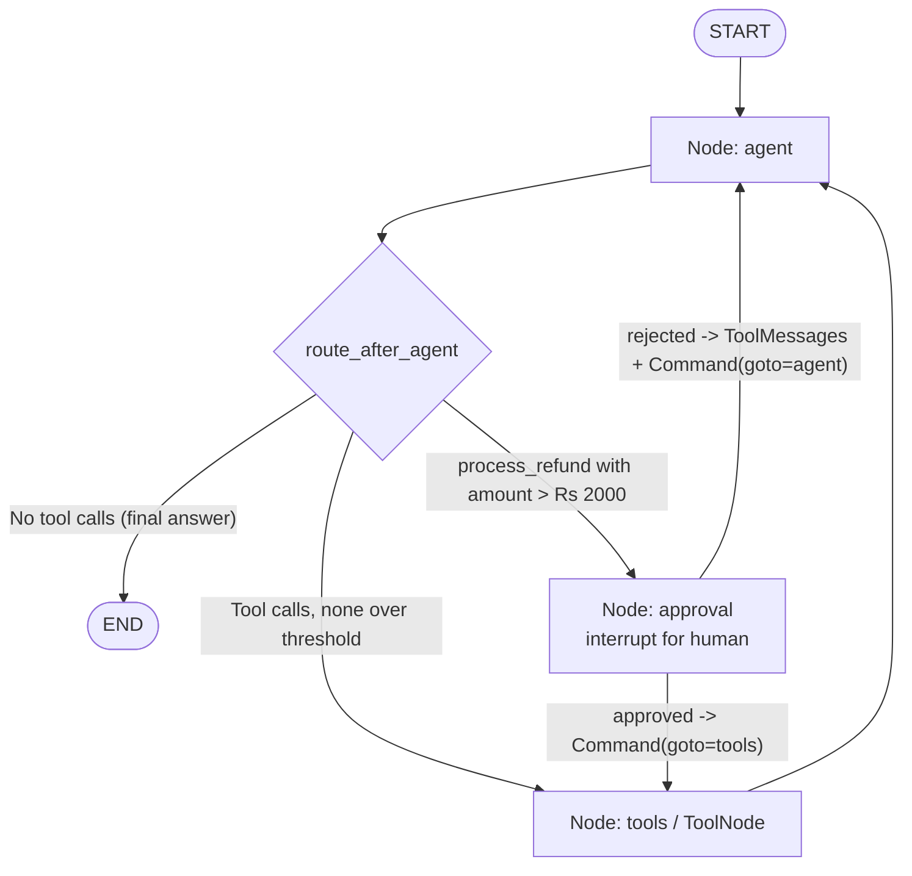

# Payments Desk - LangGraph & MCP Architecture

This document explains the architecture, workflow, nodes, edges, state schema, and MCP tools implemented in `payments_desk.py` and `mcp_server.py`.

---

## 📌 Overview

The **Payments Desk** is an agentic workflow built using **LangGraph** and the **Model Context Protocol (MCP)**. It acts as a customer support assistant for orders, refunds, weather, and general payments Q&A.

The current design is a **single ReAct loop with a human-in-the-loop approval gate**:

- One `agent` node (the LLM with all MCP tools bound) decides whether to answer directly or call tools.
- A damaged-item refund above **Rs 2000** (`APPROVAL_THRESHOLD`) is diverted to an `approval` node, which calls `interrupt()` and **pauses the graph** until a human resumes it with `Command(resume={"approved": True/False})`.
- Approved refunds proceed to the `tools` node; rejected ones get synthetic `ToolMessage`s so the agent can inform the customer the refund was denied.

---

## 🏗️ Entities & State Schema (`entities.py`)

### `State` Schema (`typing.TypedDict`)

The graph's shared memory, accessible across all nodes:

```python
class State(TypedDict):
    messages: Annotated[list[BaseMessage], add_messages]
    intent: str
    result: str
```

- **`messages`**: Annotated with LangGraph's `add_messages` reducer, so each node returns only the delta (new messages) and they are appended rather than overwritten. `HumanMessage`, `AIMessage` (with tool calls), and `ToolMessage` (with results) all accumulate here.
- **`intent` / `result`**: Legacy fields retained in the schema; the current single-agent flow no longer routes on them.

> [!NOTE]
> The `Intent` pydantic model (`order_status` / `weather` / `chat` / `refund_policy` literals) still exists in `entities.py` but is **no longer used** — the previous classify/route step was replaced by the single ReAct agent.

---

## 🔌 Model Context Protocol (MCP) Server (`mcp_server.py`)

Implemented with `FastMCP` from `mcp.server.fastmcp`, running over `stdio` transport. All logs go to `sys.stderr` so `sys.stdout` stays reserved for MCP JSON-RPC protocol traffic.

### Exposed MCP Tools

| Tool Function | Inputs | Return Type | Description |
| :--- | :--- | :--- | :--- |
| **`check_order_status`** | `order_id: int` | `dict` | Looks up an order. Sample data: `8812` damaged, `8813` shipped, `8814` pending, `8815` cancelled; unknown IDs return "Order status not found". |
| **`fetch_refund_policy`** | `status: str` | `int` | Refund percentage by order status (`"damaged"` -> 80%, `"cancelled"` -> 100%, `"shipped"` / `"pending"` -> 0%, fallback -> 50%). |
| **`refund_amount_calculator`** | `amount: int`, `refund_percentage: int` | `int` | Ceiling refund amount: `math.ceil((refund_percentage * amount) / 100.0)`. |
| **`process_refund`** *(new)* | `order_id: int`, `amount: int`, `reason: str` | `str` | **Actually executes** a refund of `amount` rupees for the order. Because it has a real side effect, calls above `APPROVAL_THRESHOLD` are gated by the human approval node before this tool is allowed to run. |
| **`get_live_weather`** | `city: str` | `str` | OpenWeatherMap lookup (uses `WEATHER_API_KEY`) returning current weather, temperature, humidity, and wind speed. |

---

## 🛠️ Architecture & Key Components Summary

1. **State Management (`State`)**: `entities.py`; messages tracked with the `add_messages` reducer.
2. **MCP Client**: `MultiServerMCPClient` in `payments_desk.py` launches `mcp_server.py` via `sys.executable` and loads tools dynamically at startup with `mcp_client.get_tools()`.
3. **LLM**: imported from `assignments.init_llm` and bound to the full MCP tool set in the `agent` node.
4. **Human-in-the-loop**: `interrupt()` inside the `approval` node + a `MemorySaver` checkpointer so the paused state can be persisted and resumed. Resumption is driven by `Command(resume={"approved": ...})`.
5. **CLI approval driver**: `run_until_done()` streams graph events, blocks on `input()` when an interrupt fires, then resumes the same `thread_id`.

---

## 🔄 LangGraph Flowchart



---

## 🧩 LangGraph Nodes Detailed Breakdown

| Node Name | Handler Function | Description |
| :--- | :--- | :--- |
| **`agent`** | `execute(state)` | Binds all MCP tools to the LLM and invokes it. Returns only the new AI message (the reducer appends it). |
| **`approval`** | `approval(state)` | Finds the pending `process_refund` tool call and calls `interrupt()` with the tool name/args, halting the graph. On resume: **approved** -> `Command(goto="tools")`; **rejected** -> builds a rejection `ToolMessage` for every pending tool call (so no call is left unanswered, which would break the next model invoke) and returns `Command(update={"messages": rejections}, goto="agent")`. |
| **`tools`** | `ToolNode(tools)` | Prebuilt LangGraph node executing the requested MCP tool calls (`check_order_status`, `fetch_refund_policy`, `refund_amount_calculator`, `process_refund`, `get_live_weather`). |

---

## 🔗 LangGraph Edges & Routing Rules

### 1. Direct Entry Edge
- `START -> "agent"`: every request goes straight to the agent — there is no separate intent-classification step anymore.

### 2. Conditional Edge from `agent` (`route_after_agent`)
- **No tool calls** in the last AI message -> `__end__` (final answer).
- **Any `process_refund` call with `amount > APPROVAL_THRESHOLD` (Rs 2000)** -> `approval` node.
- **Otherwise** -> `tools` node.

### 3. Loopback Edge
- `tools -> "agent"`: after tools execute, control returns to the agent so it can read results and chain further tool calls or produce the final answer.

### 4. Approval Self-Routing
The `approval` node has no static outgoing edges; it routes itself via `Command`:
- Approved -> `tools`
- Rejected -> `agent`

### 5. Checkpointing
- `graph = builder.compile(checkpointer=MemorySaver())` — required because `interrupt()` needs a checkpointer to save and resume the paused state. Each question runs under its own `thread_id` (`config = {"configurable": {"thread_id": ...}}`).

---

## 🏃 Execution Walkthrough

1. **Initialization**:
   - `mcp_client` spawns `mcp_server.py` via `stdio`; tools are fetched dynamically and registered.
   - `StateGraph` builds the 3 nodes (`agent`, `approval`, `tools`) and compiles with a `MemorySaver` checkpointer.

2. **Processing a query** (via `run_until_done(graph, payload, config)`):
   - **Step 1 (`agent`)**: LLM inspects the message and either answers directly or requests tool calls (e.g. `check_order_status(8812)`, `fetch_refund_policy("damaged")`, `refund_amount_calculator(3000, 80)`, `process_refund(...)`).
   - **Step 2 (`route_after_agent`)**: if a `process_refund` call exceeds Rs 2000 -> route to `approval`; else -> `tools`; no calls -> `END`.
   - **Step 3 (`approval`, only when gated)**: `interrupt()` fires; `run_until_done` detects the `__interrupt__` event, prints the pending action, and blocks on `Approve this refund? [y/n]:`. The human's decision is sent back as `Command(resume={"approved": ...})`.
   - **Step 4 (`tools`)**: executes the MCP tool calls and appends `ToolMessage` results. On rejection, this step is skipped and rejection `ToolMessage`s are injected instead.
   - **Step 5 (loop)**: back to `agent`; the model reads tool outputs and either calls more tools or produces the final response.
   - **Step 6 (`END`)**: no further tool calls -> graph finishes; the final message content is printed.

### Sample prompts (from `main()`)

1. `Order 8812 arrived damaged. I paid Rs 1000 total. Process my refund.` -> under threshold, no approval needed
2. `Courier is stuck. What is the weather in Bangalore right now?` -> weather tool, no approval
3. `What is a chargeback, in one sentence?` -> no tools

(A damaged-item refund above Rs 2000, e.g. Rs 3000, pauses for human approval.)
