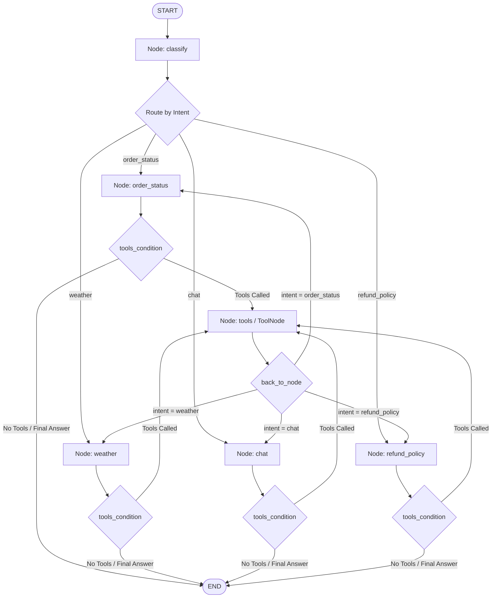

# Payments Desk - LangGraph & MCP Architecture

This document provides a detailed explanation of the architecture, workflow, nodes, edges, entity models, and MCP tools implemented in [`payments_desk.py`](file:///Users/mrinalkamboj/Library/CloudStorage/GoogleDrive-mkamboj@gmail.com/My%20Drive/Learn/Tech-Stuff/Manifold-AI.AI/Agentic-Bootcamp/Assignments/Payments_Desk/payments_desk.py).

---

## 📌 Overview

The **Payments Desk** is an agentic workflow built using **LangGraph** and the **Model Context Protocol (MCP)**. It acts as an intelligent customer support assistant capable of handling intent classification, dynamic tool discovery over MCP, and multi-step reasoning to resolve customer queries such as order status checks, refund calculations, live weather updates, and general domain Q&A.

---

## 🏗️ Entities & State Schema (`entities.py`)

Defined in [`entities.py`](file:///Users/mrinalkamboj/Library/CloudStorage/GoogleDrive-mkamboj@gmail.com/My%20Drive/Learn/Tech-Stuff/Manifold-AI.AI/Agentic-Bootcamp/Assignments/Payments_Desk/entities.py), these classes govern data structures and state transitions throughout the LangGraph lifecycle:

### 1. `Intent` Model (`pydantic.BaseModel`)
Used by the LLM during the `classify` node via `llm.with_structured_output(Intent)` to ensure type-safe classification.

```python
class Intent(BaseModel):
    name: Literal["order_status", "weather", "chat", "refund_policy"]
```

- **`name`**: Constrained to exact string literals (`"order_status"`, `"weather"`, `"chat"`, `"refund_policy"`), ensuring valid routing downstream.

### 2. `State` Schema (`typing.TypedDict`)
Defines the graph's shared memory state accessible across all nodes.

```python
class State(TypedDict):
    messages: Annotated[list[BaseMessage], add_messages]
    intent: str
    result: str
```

- **`messages`**: Annotated with LangGraph's `add_messages` reducer function. Instead of overwriting the array on each step, new messages (`HumanMessage`, `AIMessage` with tool calls, `ToolMessage` with results) are appended to preserve execution context.
- **`intent`**: Holds the current intent string (`"order_status"`, `"weather"`, `"chat"`, `"refund_policy"`). Used by router functions (`route()` and `back_to_node()`).
- **`result`**: Stores the final human-readable string response generated by the LLM.

---

## 🔌 Model Context Protocol (MCP) Server (`mcp_server.py`)

The MCP server in [`mcp_server.py`](file:///Users/mrinalkamboj/Library/CloudStorage/GoogleDrive-mkamboj@gmail.com/My%20Drive/Learn/Tech-Stuff/Manifold-AI.AI/Agentic-Bootcamp/Assignments/Payments_Desk/mcp_server.py) is implemented using `FastMCP` from `mcp.server.fastmcp`. It runs over `stdio` transport and exposes specialized tools for the agent to call asynchronously.

> [!NOTE]
> All logs in `mcp_server.py` are routed to `sys.stderr` via `logging.basicConfig(..., stream=sys.stderr)` so that `sys.stdout` is exclusively reserved for MCP JSON-RPC protocol communication.

### Exposed MCP Tools

| Tool Function | Inputs | Return Type | Description |
| :--- | :--- | :--- | :--- |
| **`check_order_status`** | `order_id: int` | `dict` | Looks up the status of an order ID. Returns order details (e.g. `8812` -> damaged, `8813` -> shipped, `8814` -> pending, `8815` -> cancelled). |
| **`fetch_refund_policy`** | `status: str` | `int` | Returns the eligible refund percentage based on order status (`"damaged"` -> 80%, `"cancelled"` -> 100%, `"shipped"` / `"pending"` -> 0%, fallback -> 50%). |
| **`refund_amount_calculator`** | `amount: int`, `refund_percentage: int` | `int` | Calculates ceiling refund amount using the formula: `math.ceil((refund_percentage * amount) / 100.0)`. |
| **`get_live_weather`** | `city: str` | `str` | Calls OpenWeatherMap API using `WEATHER_API_KEY` to retrieve current weather, temperature, humidity, and wind speed for a specified city. |

---

## 🛠️ Architecture & Key Components Summary

1. **State Management (`State`)**: Defined in [`entities.py`](file:///Users/mrinalkamboj/Library/CloudStorage/GoogleDrive-mkamboj@gmail.com/My%20Drive/Learn/Tech-Stuff/Manifold-AI.AI/Agentic-Bootcamp/Assignments/Payments_Desk/entities.py), tracks message state with `add_messages` reducer.
2. **MCP Client**: `MultiServerMCPClient` in [`payments_desk.py`](file:///Users/mrinalkamboj/Library/CloudStorage/GoogleDrive-mkamboj@gmail.com/My%20Drive/Learn/Tech-Stuff/Manifold-AI.AI/Agentic-Bootcamp/Assignments/Payments_Desk/payments_desk.py) launches `mcp_server.py` via `sys.executable` and loads tools dynamically at startup via `mcp_client.get_tools()`.
3. **Structured Intent Classifier**: Pydantic model `Intent` constrains classification outputs to: `"order_status"`, `"weather"`, `"chat"`, or `"refund_policy"`.

---

## 🔄 LangGraph Flowchart



---

## 🧩 LangGraph Nodes Detailed Breakdown

| Node Name | Handler Function | Description |
| :--- | :--- | :--- |
| **`classify`** | `classify(state)` | Uses LLM with structured output (`Intent`) to analyze user message and determine query category. Writes intent to `state["intent"]`. |
| **`order_status`** | `execute(state)` | Binds MCP tools to LLM. Handles order status and refund lookup execution. |
| **`weather`** | `execute(state)` | Binds MCP tools to LLM. Invokes live weather lookup tools when needed. |
| **`chat`** | `execute(state)` | Binds MCP tools to LLM. Handles general inquiries (e.g. defining chargebacks). |
| **`refund_policy`** | `execute(state)` | Binds MCP tools to LLM. Resolves general refund policy questions. |
| **`tools`** | `ToolNode(tools)` | Prebuilt LangGraph `ToolNode` containing MCP tools (`check_order_status`, `fetch_refund_policy`, `refund_amount_calculator`, `get_live_weather`). Executes tool calls requested by model. |

---

## 🔗 LangGraph Edges & Routing Rules

### 1. Direct Entry Edge
- `START -> "classify"`: Every incoming request starts at the `classify` node.

### 2. Conditional Intent Router Edge
- **Source**: `classify` node
- **Routing Function**: `route(state)` -> reads `state["intent"]`
- **Destination Mapping**:
  - `"order_status"` $\rightarrow$ `order_status` node
  - `"weather"` $\rightarrow$ `weather` node
  - `"chat"` $\rightarrow$ `chat` node
  - `"refund_policy"` $\rightarrow$ `refund_policy` node

### 3. Tool Invocation Conditional Edges (`tools_condition`)
Each execution node (`order_status`, `weather`, `chat`, `refund_policy`) evaluates `tools_condition` after LLM invocation:
- If the model response contains tool calls: Routes to `tools` node.
- If no tool calls are present (final response generated): Proceed to `END`.

### 4. Loopback Routing Edge (`back_to_node`)
- **Source**: `tools` node
- **Routing Function**: `back_to_node(state)` -> checks `state["intent"]`
- **Destination**: Returns control back to the originating node (`order_status`, `weather`, `chat`, or `refund_policy`) so the LLM can review tool outputs and synthesize a complete response.

### 5. Exit Edges
- `order_status -> END`
- `weather -> END`
- `chat -> END`
- `refund_policy -> END`

---

## 🏃 Execution Walkthrough

1. **Initialization**:
   - `mcp_client` spawns `mcp_server.py` via `stdio`.
   - Tools are fetched dynamically and registered in global `tools`.
   - `StateGraph` builder constructs nodes, edges, and compiles into `graph`.

2. **Processing Query**:
   - User prompt submitted via `graph.ainvoke({"messages": [HumanMessage(...)]})`.
   - **Step 1 (`classify`)**: LLM inspects user message and classifies intent (e.g., `order_status`).
   - **Step 2 (`route`)**: Directs execution flow to `order_status` node.
   - **Step 3 (`execute`)**: Model decides it needs tool calls (e.g. `check_order_status(8812)`).
   - **Step 4 (`tools_condition`)**: Detects tool call request $\rightarrow$ routes to `tools` node.
   - **Step 5 (`tools`)**: `ToolNode` executes MCP tool and appends `ToolMessage` result.
   - **Step 6 (`back_to_node`)**: Inspects `intent` (`order_status`) and loops back to `order_status` node.
   - **Step 7 (`execute`)**: Model reads tool output, crafts final user-facing response, and returns result.
   - **Step 8 (`tools_condition` & `END`)**: No further tool calls requested $\rightarrow$ reaches `END`.
